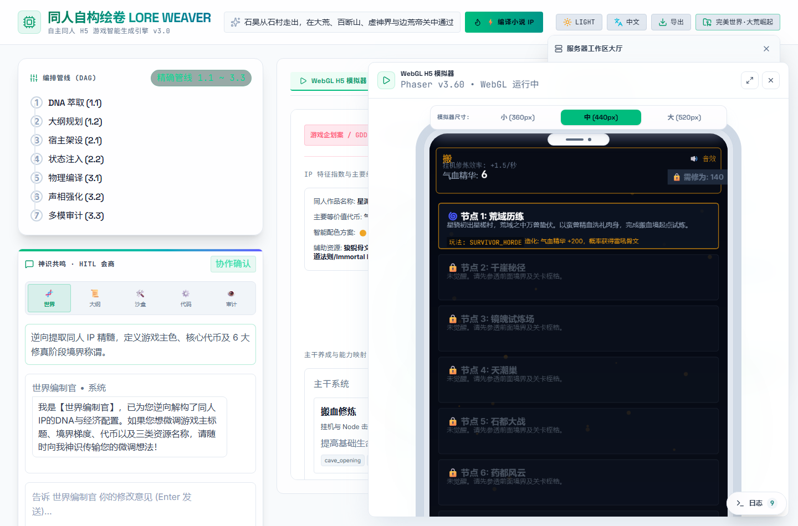
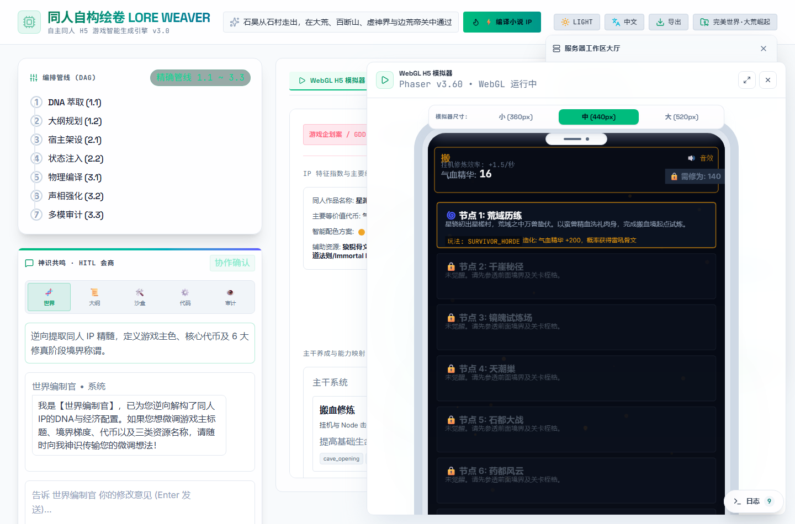
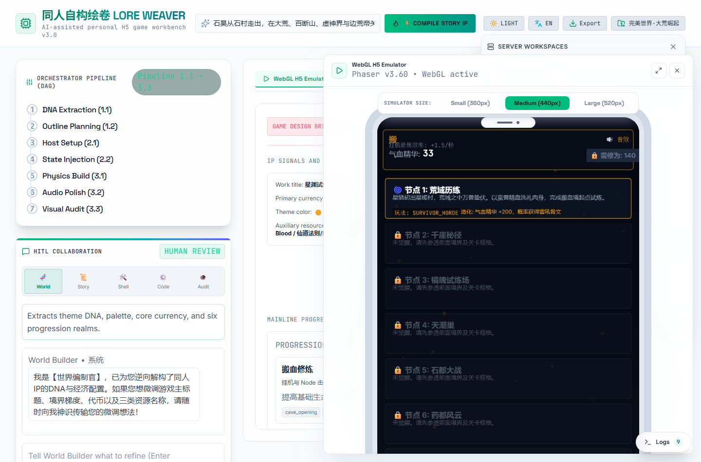
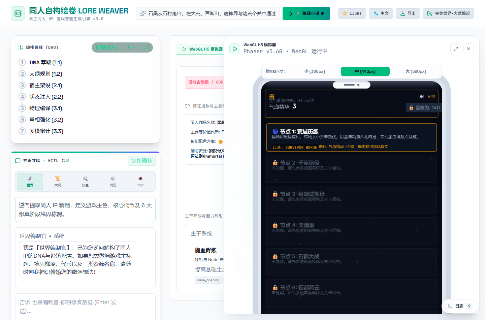

# LoreWeaver

LoreWeaver is an AI-assisted personal game workbench for turning a theme,
world setting, or narrative direction into a playable H5 prototype. It combines
a React workbench UI, a Phaser game emulator, a manifest-driven gameplay-card
system, and a FastAPI agent backend.

The current product direction is not a one-shot game generator. LoreWeaver is
designed as a controllable personal workflow for building, revising, auditing,
and reusing small game prototypes.

## Product Showcase / 产品形态效果展示

Here is the visual walkthrough of the LoreWeaver AI game workbench.
以下是 LoreWeaver 个人游戏工作台各功能板块的实际界面效果展示：

### 1. Main Workbench & Simulator / 主工作台与 H5 模拟器
The main dashboard displays the orchestrator DAG pipeline on the left, the real-time world-building agent chat in the middle (supporting HITL micro-adjustments), and the active WebGL H5 Phaser game simulator on the right.
主控制面板：左侧为自动化编排 DAG 管线，中间为双语智能助手（支持人机协作微调数值与境界），右侧为内嵌的 Phaser WebGL 物理模拟器。


---

### 2. Tab Navigation & Interactive Panels / 板块导航与交互面板

| Functional Module / 功能模块 | Interface Snapshot / 界面截图 | Description / 功能详述 |
| :--- | :--- | :--- |
| **Workspace Selector**<br>工作区项目大厅 |  | Manages localized isolated project sandboxes and directory imports.<br>支持隔离工作区的新建、导入和多项目平滑切换。 |
| **Design Brief (GDD)**<br>小说 IP 企划方案 |  | Displays generated theme settings, core economies, and progression levels.<br>系统自动解构生成的同人小说 IP 专属设计文案与数值蓝图。 |
| **Gameplay Catalog**<br>玩法卡工作台 |  | Patches individual level nodes with gameplay cards and modifiers (e.g. survivor horde).<br>以可复用玩法卡与修饰器（如割草、反应聚灵）对关卡进行局部分片修补。 |
| **Manifest Editor**<br>游戏配置清单 |  | Views and validates the unified `manifest.json` game configuration.<br>查看并校验驱动游戏运转的统一标准化 JSON 数据注册表。 |
| **VLM Visual Audit**<br>视觉多模态审计 |  | Automatically detects layout overlaps, text wrapping, and page hygiene via Vision models.<br>通过大语言视觉模型（VLM）智能判定游戏画面的折行溢出与重叠异常。 |
| **Multilingual Support**<br>国际化语言切换 |  | Demonstrates full English and Chinese localization of the workbench.<br>支持中英文双语一键无缝切换，适配全球化协同场景。 |

---

### 3. Startup & Empty State / 初始状态与冷启动
When no theme is compiled or active, the workbench presents an elegant empty state prompting the user to type an IP theme and hit the compilation switch.
在未加载或编译任何主题前，工作台展示优雅的冷启动状态，指引用户输入修真/东方同人设定并一键唤醒管线。



## What It Does

- Creates isolated project workspaces from a name and theme.
- Generates or loads a `manifest.json` game spec for each workspace.
- Organizes a 12-node narrative/progression structure with economy, resources,
  realms, rewards, difficulty, and gameplay assignments.
- Runs the current spec in a Phaser-powered emulator with idle cultivation,
  realm breakthrough, node progression, audio feedback, and local player state.
- Provides human-in-the-loop agent panels for world building, narrative,
  sandbox architecture, code/runtime tuning, and visual audit feedback.
- Supports Gameplay Cards and modifiers so individual nodes can be mapped to
  reusable gameplay patterns instead of hard-coded one-off scenes.
- Stores gate and audit outputs under `workflow/reports/` for build, runtime,
  scene hygiene, and content safety checks.

## Architecture

```text
React + Vite UI
  -> Express dev gateway on port 3000
  -> FastAPI backend on port 8000
  -> SQLite/workspace files under data/workspaces/
  -> Phaser runtime and gameplay adapters
```

Key parts:

- `src/App.tsx` - main workbench shell, emulator, tabs, orchestration state.
- `src/game/GameRunner.ts` - Phaser runtime used by the in-browser emulator.
- `src/components/` - PRD, gameplay, VLM, workspace, and agent chat panels.
- `src/utils/gameplayManifest.ts` - Gameplay Card catalog, patch helpers, and
  manifest normalization.
- `backend/main.py` - FastAPI workspace, job, refinement, preset, and audit APIs.
- `backend/agents.py` - Gemini-backed or procedural fallback GDD generation and
  refinement.
- `docs/` - active design contracts, roadmaps, gameplay card schema, and audit
  backlog.
- `workflow/` - prompt templates, agent notes, scripts, and latest report files.

## Local-First Directory Access Rule

LoreWeaver is a local personal workbench: the browser UI, Express gateway, and
FastAPI backend are expected to run on the same developer machine. Directory
selection and project import must preserve that assumption.

When the user clicks "Choose Folder" / "选择目录", the intended flow is:

```text
Browser UI
  -> Express gateway `/api/system/select-directory`
  -> FastAPI opens the native local folder picker
  -> FastAPI returns the selected absolute local path
  -> Browser calls `/api/workspaces/import` with that path
  -> FastAPI copies the local directory into `data/workspaces/`
```

Do not replace this with a generic web upload flow such as
`<input webkitdirectory>` plus multipart upload. That approach treats the local
tool as if the browser and backend were on different machines, unnecessarily
streams the whole project through the browser, hides the real local path, and
can create confusing errors such as empty or non-JSON gateway responses.

If the native folder picker is unavailable, keep manual path paste as the
fallback. The backend should still be the component that reads and copies the
local project directory.

## Gameplay Cards

LoreWeaver keeps gameplay choices in reusable cards. A node can select a base
gameplay card and optional modifiers, allowing local patching without rewriting
the whole project.

Current catalog (all wired through `minigame_master` + `GameRunner`):

- `survivor_horde` - Phaser survivor horde adapter + 6 modifiers
  (`hazard_telegraph`, `defend_core`, `escort_npc`, `boss_phases`,
  `poison_fog`, `laser_warning`).
- `rhythm_timing` / `drag_collect_grid` - Phaser tap-reaction and
  collect-dodge adapters.
- `turn_based_skill_battle` - Phaser turn-based skill combat.
- `sequence_synthesis` - Phaser ordered crafting / recipe sequence.
- `side_scrolling_brawler` - Phaser belt-scroll brawler + 6 modifiers
  (`locked_screen_wave`, `arcade_timer_pressure`, `arcade_credit_continue`,
  `elemental_directional_combo`, `local_coop_4p`, `branch_route_chain`).
- `node_iframe_microgame` - `IframeNodeContainer` for HTML node pages via
  NodePayload/postMessage.
- `energy_balance` / `rune_connect_sequence` / `branching_dialogue_check` -
  Path-style microgames (gauge balance, ordered rune links, favor dialogue).
- Extra `survivor_horde` modifiers: `crystal_collection`, `horde_intensity`,
  `resource_pressure`, `defend_line`, `debuff_zone`, `destroy_pillars`.
- Path action microgames: `pressure_survival`, `reaction_pick`,
  `observe_capture`, `shooter_duel`, `drag_to_core`, `dodge_counter_boss`.
- Brawler `score_extend_1up` modifier (score-threshold extra lives).
- Path remaining: `maze_exploration_choice`, `platform_escape`,
  `hazard_collect_waves`, `sequence_puzzle_combo`, `rhythm_then_pickup`.
- More survivor modifiers: `treasure_chest_horde`, `arena_wave_boss`,
  `random_room_portals`, `mirror_boss`, `self_destruct_enemy`.
- Cross-engine: `qix_area_capture` (area claim / Qix),
  `point_drag_progression` (element point drag + branch weights).
- Multi-agent prep desk (film-style departments): each production link is an
  independent department agent with ownership, confirm state, QA score, and
  handoffs — see `docs/workflow/production_department_agents.md` and
  `docs/workflow/department_agents.registry.json`.
- Art wiring: `RuntimeArtBinder` installs full imagegen atlas frames at Boot,
  then adapters resolve player/enemy/projectile/pickup textures atlas-first
  (procedural fallback). Clip playback (`walk`/`attack`/`hurt`/`death`),
  `env_bg_*` backgrounds, and modifier props (`core_eye`, `escort_npc`,
  `portal_ring`, `wall_segment`, …) are wired. See
  `docs/contracts/asset_pipeline_contract.md` §4.1.

## Local Development

Prerequisites:

- Node.js
- Python 3
- Optional LLM key for AI generation, refinement, and department prep:
  - **Recommended:** `XAI_API_KEY` (Grok / xAI, OpenAI-compatible)
  - Fallback: `GEMINI_API_KEY` (Google Gemini)

Install dependencies:

```bash
npm install
python3 -m pip install -r backend/requirements.txt
```

Create a local environment file:

```bash
cp .env.example .env
```

Then set an API key in `.env`:

```bash
# Prefer Grok
XAI_API_KEY="xai-..."
LLM_PROVIDER=grok
# Optional model (default grok-4-1-fast-non-reasoning)
# XAI_MODEL=grok-4.5

# Or Gemini
# GEMINI_API_KEY="..."
# LLM_PROVIDER=gemini
```

Without a key, the backend falls back to procedural presets for generation and
mock adjustments for some refinement paths. Check `GET /api/llm/status` after
startup to confirm the active provider.

Start the workbench:

```bash
npm run dev
```

Open:

```text
http://localhost:3000
```

The Express gateway starts the FastAPI backend automatically and proxies `/api`
requests to `http://127.0.0.1:8000`.

## Useful Scripts

```bash
npm run dev      # Start Express + Vite gateway and FastAPI bridge
npm run build    # Build frontend and bundled production server
npm run start    # Start the production server from dist/
npm run lint     # Run TypeScript checks
npm run clean    # Remove generated build output
```

The repository also includes `start.sh` and `start.bat` in the standalone
LoreWeaver repository layout for one-click setup on macOS/Linux and Windows.

## API Surface

The backend exposes workspace and pipeline endpoints through `/api`:

- `POST /api/workspaces` - create a workspace.
- `GET /api/workspaces` - list saved workspaces.
- `GET /api/workspaces/{id}` - read workspace metadata.
- `GET/POST /api/workspaces/{id}/files/{filename}` - load or save workspace JSON.
- `GET /api/presets?theme=...` - generate a procedural preset.
- `POST /api/jobs/start` - start the staged GDD/orchestration pipeline.
- `GET /api/jobs/{id}` - inspect pipeline status and results.
- `POST /api/jobs/{id}/approve` - approve a generated spec for compilation.
- `POST /api/jobs/{id}/chat` - refine a pending job through an agent role.
- `POST /api/workspaces/{id}/refine` - refine an existing workspace manifest.
- `GET /api/workspaces/{id}/export` - download a ZIP with `manifest.json`,
  a standalone `index.html` preview shell, and the reusable `core/lib` and
  `core/demo` runtime sources.
- `POST /api/audit` - submit screenshot/audit payloads.

## Local Model Support

Ollama/local-model routing is intentionally deferred for now. If
`OLLAMA_API_BASE` is present in the environment, the backend logs that the value
is ignored and continues to use Grok when `XAI_API_KEY` is set, Gemini when
`GEMINI_API_KEY` is set, or the procedural fallback when neither is available.

## Data and Generated Artifacts

Local runtime data is written under:

```text
data/workspaces/
```

Each workspace can contain:

- `meta.json` - workspace identity, theme, and timestamps.
- `manifest.json` - the active game spec consumed by the workbench and emulator.

Audit and gate report snapshots live under:

```text
workflow/reports/
```

## Documentation

Start with:

- `docs/README.md` - active document index.
- `docs/architecture/current_system_architecture_and_core_features.md` - current system architecture and core feature design.
- `docs/roadmap/LoreWeaver_Workbench_Gameplay_Core_Roadmap.md` - current product and
  gameplay-core direction.
- `docs/gameplay/gameplay_card_schema.md` - Gameplay Card schema and review gate.
- `docs/architecture/core_contracts.md` - runtime contracts for payloads, results, adapters,
  modifiers, lifecycle, and test hooks.
- `docs/workflow/patch_revision_workflow.md` - patch and revision workflow.

## License / 授权

This project is released under the [LoreWeaver Personal Use License](LICENSE).
It is a custom source-available license, not an open-source license.

- Personal, non-commercial use is permitted.
- Commercial use is prohibited unless prior written authorization is obtained
  from the author.
- Commercial use includes business use, client work, paid services, hosted
  services, resale, sublicensing, integration into commercial products, and
  internal company or organization use.
- All rights not expressly granted are reserved by the author.

本项目采用自定义的 LoreWeaver Personal Use License。仅允许个人、非商业目的使用；
任何商业化使用、公司或组织内部使用、客户项目、收费服务、托管服务、转售、再授权，
或集成到商业产品中，均须事先获得作者书面授权。
