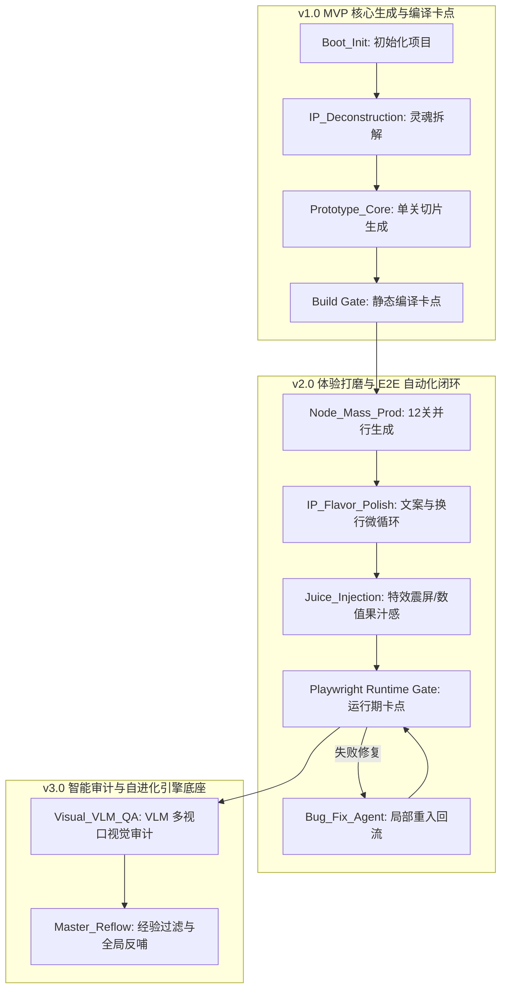

## 主打“同人IP灵魂”与“绘卷构建”（最懂二次元/粉丝圈）

如果你的引擎未来主要面向同人社区、网文/动漫粉丝，让他们能用低门槛将心中所想化为“Main + 12 节点”的微端，可以用这个极具叙事感的命名。

* **中文名称**：**意境绘卷**（或：**魂谱引擎**）
* **英文名称**：**LoreWeaver**（或：**SagaDAG**）
* **寓意解析**：
  * `Lore`（世界观/历史背景/IP 知识库），代表引擎对原著 DNA 的提取能力；
  * `Weaver`（编织者）或 `DAG`（图谱），代表将碎片化的名场面编织成 12 个可玩 Node 的硬核过程。

---

开发 AI 游戏生成引擎，最忌讳的就是想靠一个“超级提示词”或一个简单的线性流程“一步到位”。

游戏开发，尤其是追求独立游戏品质和同人沉浸感的项目，其本质是**持续的“加果汁”（Juicing）和增量重构**。正如“氛围编程（Atmosphere Programming）”和 `00_TASK_HISTORY.md` 的设定，AI 需要在一个动态的上下文中反复打磨、自测、纠偏。

将这个过程拆解为 **DAG（有向无环图）工作流引擎** 是唯一的正确解。我们可以把每个打磨动作（如：Node 原型、IP 文案增强、VFX 果汁感、Playwright 视觉验收）抽象为 DAG 中的一个**节点（Task Node）**，节点间有依赖，且允许**条件分支（Conditional Branching）**和**局部微循环（Local Iteration Loop）**。

下面为该 AI Agent 引擎规划的 **User Stories（用户故事）及渐进式版本迭代路线图**。

---

# AI 同人游戏生成引擎 (DAG-driven) 需求文档

## 1. 核心史诗 (Epics) 蓝图与渐进式版本迭代规划

为了稳步推进 LoreWeaver 引擎的实现，避免“一步到位”带来的过高开发风险，我们将整个系统构想划分为 **3 个关键版本迭代**。复杂的智能质量卡点与自进化机制被合理后置，优先保障核心代码生成与编译通路的闭环。

### 📌 版本迭代规划概览 (Roadmap Overview)

---

## 2. 迭代版本及用户故事 (User Stories) 详述

---

### 🟢 Phase 1: v1.0 - MVP 核心通路与单向代码生成验证
> **核心目标**：跑通“单项目”的核心生成流程与基础项目结构，证明从“IP 主题”到“静态编译打包”的最低限度闭环。

#### User Story 1.1: 线性任务调度与工程初始化 [v1.0]
* **描述**：作为一个**游戏开发者**，我希望引擎能够输入同人主题后，自动执行线性流水线（初始化 -> IP拆解 -> 骨架生成 -> 首关垂直切片），并能成功执行生产编译。
* **验收标准 (AC)**：
  1. 引擎支持线性调度：按顺序触发 `Boot_Init`、`IP_Deconstruction` 和 `Prototype_Core` 节点。
  2. 自动生成包含 Phaser + Vite 基础结构的项目骨架及 `package.json`。
  3. **静态编译卡点 (Build Gate)**：自动化执行 `npm run build`，若打包失败则中断流程，不允许假成功。

#### User Story 1.2: 静态数据注册表（NODE_REGISTRY）自动化注入 [v1.0]
* **描述**：作为一个**策划 Agent**，我希望通过分析同人题材，自动生成并扩展 `js/data.js` 中的 12 个 Node 核心剧情数据，为后续关卡提供配置底座。
* **验收标准 (AC)**：
  1. 自动化分析并产出包含 `id`, `title`, `intro`, `taunts`（原著经典台词）, `mechanics`（核心机制）, `rewards`（首通奖励）的 `data.js` 配置文件。
  2. 剧情梯度清晰，覆盖原著前中后期经典战役/名场面。

#### User Story 1.3: 基于 docs/ 的单项目短期记忆同步 [v1.0]
* **描述**：作为一个**执行 Agent**，我希望在被唤醒时能读取项目当前上下文（PRD、架构决策），执行完毕后将所作修改追加记录，避免上下文漂移。
* **验收标准 (AC)**：
  1. 节点启动前前置同步 `01_PRD.md` 和 `09_PLAN.md`。
  2. 节点执行完毕后，必须将当前节点的变更与操作记录回写至 `00_TASK_HISTORY.md`。

---

### 🔵 Phase 2: v2.0 - 局部编排重构、细节打磨与 E2E 自动化测试门禁
> **核心目标**：解决游戏“空壳、不好玩”和“假成功（黑屏、点击无响应）”的问题。引入多关卡并行生成、果汁感(Juicing)注入以及 Playwright 运行时自动化断言。

#### User Story 2.1: 并发生成与条件分支调度 [v2.0]
* **描述**：作为一个**游戏开发者**，我希望引擎能并发生成其余 11 个关卡文件，并在编译或测试失败时，通过条件分支自动流向 Bug 修复 Agent。
* **验收标准 (AC)**：
  1. 引擎调度器支持 **并行执行 (Parallel Execution)**：支持多个关卡 Node 文件的并发量产。
  2. 支持 **条件分支 (Conditional Branching)** 与局部微循环：一旦 E2E 测试或编译卡点失败，自动将错误日志发给 `Bug_Fix_Agent` 并回流重试。

#### User Story 2.2: IP 文案增强与 Phaser 文本兼容性微循环 [v2.0]
* **描述**：作为一个**编剧 Agent**，我希望对所有关卡文本进行润色以注入原著梗，并强制进行换行排版处理以防溢出。
* **验收标准 (AC)**：
  1. 检索并使用原著高频词汇与特色文案（如“尊魂幡”、“逆天突破”），替换通用占位符。
  2. 自动在生成的 Phaser 代码中为中文 `Text` 对象追加 `{ wordWrap: { width: 520, useAdvancedWrap: true } }` 属性，确保多端阅读无爆框。

#### User Story 2.3: 核心 IP 能力的视觉与数值“果汁感”映射 [v2.0]
* **描述**：作为一个**特效与数值 Agent**，我希望通过程序化手段为核心技能注入震屏、飘字、特效，并根据境界设计指数级数值成长公式。
* **验收标准 (AC)**：
  1. 凡触发核心大招，代码中自动注入视觉反馈逻辑（例如震屏 `this.cameras.main.shake(200, 0.01)` 与粒子溅射特效）。
  2. 数值公式与 `Store` 内的角色境界挂钩，实现断层式的数值膨胀与成长爽感。

#### User Story 2.4: 移动端触控安全区与点击热区适配 [v2.0]
* **描述**：作为一个**前端优化 Agent**，我希望游戏能自适应移动端屏幕大小，并保证交互按钮易于点击。
* **验收标准 (AC)**：
  1. 项目初始化配置统一适配 `Phaser.Scale.FIT`，设计视口基准为竖屏 `720x1280`。
  2. 自动扫描交互式图标，凡热区小于 60px 的组件，强制通过 Phaser `setInteractive` 扩展其交互响应区。

#### User Story 2.5: Runtime E2E 自动化交互门禁 [v2.0]
* **描述**：作为一个**测试 Agent**，我希望能够使用 Playwright 启动游戏并模拟用户真实游玩过程，断言控制台无报错且状态能正确更新。
* **验收标准 (AC)**：
  1. 使用 Playwright 启动编译后的本地服务，自动进入关卡 Node 模拟战斗/操作 5 秒并执行结算退出。
  2. 捕获浏览器 `console.error` 日志，断言无致命黑屏或死锁，并验证 `Store` 状态正常写入。

---

### 🟣 Phase 3: v3.0 - 智能审计与自进化引擎底座
> **核心目标**：实现全自动的“生产-测试-视觉把关-修复-提炼沉淀”闭环。通过大模型视觉审计非代码层面的 UI 瑕疵，并实现跨项目的自进化反哺。

#### User Story 3.1: 跨设备多视口大模型视觉审计 (Visual QA) [v3.0]
* **描述**：作为一个**视觉 QA Agent**，我希望能够自动截取游戏在不同终端分辨率下的关键界面，并通过视觉大模型 (VLM) 智能识别 UI 遮挡、穿模、文字溢出等常规测试无法捕获的体验问题。
* **验收标准 (AC)**：
  1. 自动执行多视口渲染截图（如桌面宽屏 1920x1080 和移动端竖屏 393x852 模拟），重点覆盖战前动员、游戏主 HUD、结算弹窗。
  2. 自动将截图提供给 VLM 视觉审计模块，检查“按钮是否重叠”、“文字是否被 HUD 遮挡”，并以 JSON 规范格式输出 UI 修复提案。

#### User Story 3.2: 踩坑经验自动提炼与 Master Prompt 全局反哺 [v3.0]
* **描述**：作为一个**知识管理 Agent**，我希望在项目交付后，自动将过程中沉淀的本地踩坑记录去敏感化后写回全局模板，让后续生成的游戏越来越稳健。
* **验收标准 (AC)**：
  1. 扫描当前项目的 `07_RULES_AND_BUGS.md`，过滤掉特定 IP 的剧情与专属数值设定。
  2. 提炼出通用的 Phaser API 踩坑记录、Vite 配置经验和 Playwright 调试最佳实践，自动追加到全局 `minigame_master/workflow/prompts/`，持续迭代基础知识库。

---

## 3. 核心技术架构执行流与版本归属 (DAG Flow & Milestones)

根据上述迭代规划，LoreWeaver 引擎的底层执行流在各个版本的建设范围如下表所示：

| 阶段 | 节点名称 (DAG Node) | 引入版本 | 执行角色 (Agent Role) | 输入资产 | 输出/断言验证 (Gates) |
| :---: | :--- | :---: | :--- | :--- | :--- |
| **0** | **Boot_Init** | **v1.0** | Workflow Director | 用户同人主题词 | 生成 `package.json`, 补齐 `docs/` 架构分片。 |
| **1** | **IP_Deconstruction** | **v1.0** | Core Spec Designer | 同人主题 + 原始模板 | 产出满足 `NODE_REGISTRY` 标准的 `01_PRD.md`。 |
| **2** | **Prototype_Core** | **v1.0** | Full-Stack Dev Agent | `02_ARCHITECTURE.md` | **构建编译卡点**：跑通 MainScene + Node 1 核心编译。 |
| **3** | **Node_Mass_Prod** | **v2.0** | Parallel Node Workers | `data.js` 注册表 | **并行量产**：并发完成 12 个 Node 独立关卡代码的生成。 |
| **4** | **IP_Flavor_Polish** | **v2.0** | Copywriter Agent | 原著经典语料 | **子流循环**：文本全中文处理、高级换行、原著梗注入。 |
| **5** | **Juice_Injection** | **v2.0** | VFX & Audio Agent | `06_GAME_FEEL.md` | **子流循环**：注入 Camera Shake、飘字、特效粒子。 |
| **6** | **E2E_Gatekeeper** | **v2.0** | Playwright Tester | 游戏 dist 产物 | **运行门禁**：无 console.error，通过关卡进出与状态断言。 |
| **7** | **Visual_VLM_QA** | **v3.0** | Vision Critic Agent | Playwright 截图 | **智能视觉门禁**：VLM 确认多设备视口无布局错位与重叠。 |
| **8** | **Master_Reflow** | **v3.0** | Knowledge Distiller | `07_RULES_AND_BUGS.md`| **进化终点**：提炼去敏感化经验，更新全局通用提示词库。 |
