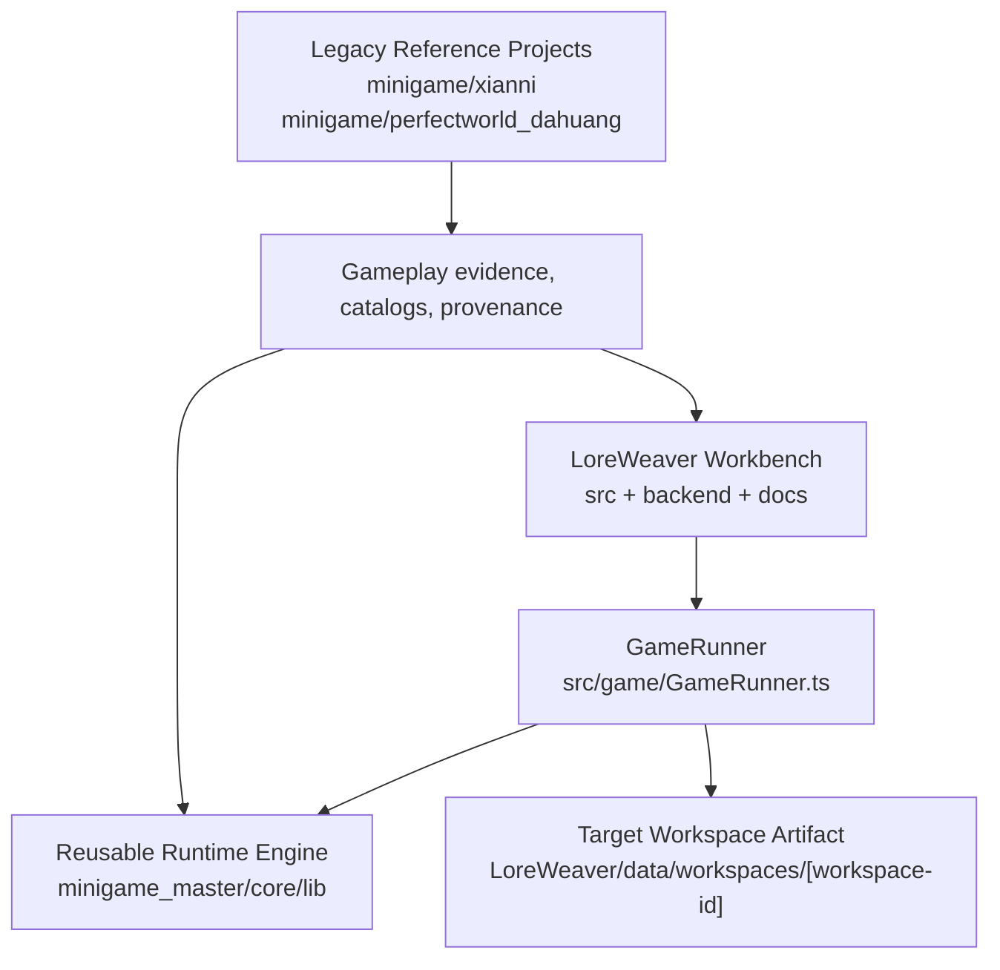

# LoreWeaver Docs Index

This file is mandatory reading whenever entering the `LoreWeaver` project.

## Must-Read Architecture Boundary

`LoreWeaver` is not the same thing as the old `minigame/*` projects. Before making changes, identify which surface the user is actually testing.



| Zone | Role | Write Guidance |
| --- | --- | --- |
| `LoreWeaver/src` | Workbench shell UI, emulator host, manifest editing, orchestration UI | Change this when the LoreWeaver app itself needs a panel, control, workflow, or runtime payload bridge. UI components here are not the generated game runtime. |
| `LoreWeaver/backend` | API, workspace persistence, import/export, orchestration endpoints | Change this when workspace files, jobs, presets, or export behavior are wrong. |
| `minigame_master/core/lib` | Reusable engine/runtime contracts and gameplay adapters | Change this when the WebGL emulator/core gameplay behavior is wrong across generated workspaces. Keep it generic and avoid IP-specific story text. |
| `LoreWeaver/data/workspaces/[workspace-id]` | Concrete generated target workspace artifact that the user may be testing directly | Change this when the user names a specific target workspace, such as `LoreWeaver/data/workspaces/20260611-060754-719406`. This directory is git-ignored, so verify by direct file inspection/builds, not only `git status`. |
| `minigame/xianni` | Legacy reference project | Read as evidence/provenance only unless the task explicitly asks to modify the old project. |
| `minigame/perfectworld_dahuang` | Legacy reference/source package for old H5 implementation and some LoreWeaver manifests/catalogs | Read as evidence/provenance or source-package material only. Do not place new LoreWeaver Workbench UI here. Do not assume edits here automatically affect a target workspace. |

### Practical Routing Rules

- If the user says they tested a **LoreWeaver target workspace**, inspect and patch `LoreWeaver/data/workspaces/[workspace-id]` first.
- If the user says the **Workbench emulator** still renders wrong, inspect `LoreWeaver/src/game/GameRunner.ts` and the relevant adapter under `minigame_master/core/lib`.
- If the task is about **Workbench panels, tabs, controls, or app chrome**, edit `LoreWeaver/src/components` and related Workbench CSS.
- If the task is about **manifest schemas, gameplay cards, runtime feature packs, gates, or docs**, edit `LoreWeaver/docs`, `LoreWeaver/minigame_master/templates`, `LoreWeaver/minigame_master/capabilities`, `LoreWeaver/minigame_master/skills`, and associated schema/check scripts.
- Treat `minigame/xianni` and `minigame/perfectworld_dahuang` as legacy references by default. They can inform adapters, manifests, catalogs, and tests, but they are not the active target workspace unless the user explicitly says so.
- When a reusable runtime change is made, also check whether any named target workspace must be synced or regenerated. A passing core build does not prove a git-ignored workspace artifact changed.
- If a request can plausibly refer to more than one surface, ask one clarifying question before editing. Do not guess between Workbench UI, engine runtime, target workspace artifact, and legacy reference project.

For the full boundary policy, read `architecture/LoreWeaver_Workspace_Boundaries.md` before making architectural or runtime edits.

---

This directory is split into active workbench documents and archived reference material.

## Active Documents By Category

These files describe the current planning, contracts, schemas, gates, and operating rules.

### Architecture

| File | Purpose |
| --- | --- |
| `architecture/current_system_architecture_and_core_features.md` | Current implemented architecture and core feature design |
| `architecture/LoreWeaver_Workspace_Boundaries.md` | Write boundaries between case studies, core runtime, and workbench |
| `architecture/core_contracts.md` | Stable NodePayload, NodeResult, adapter, modifier, lifecycle, and test hook contracts |

### Roadmap

| File | Purpose |
| --- | --- |
| `roadmap/0_TASKLIST.md` | Current roadmap and execution backlog |
| `roadmap/LoreWeaver_Workbench_Gameplay_Core_Roadmap.md` | Current product and gameplay-core direction |

### Gameplay Library

| File | Purpose |
| --- | --- |
| `gameplay/gameplay_inventory.md` | Active evidence inventory for gameplay cards and runtime planning |
| `gameplay/gameplay_card_schema.md` | Gameplay Card schema and review gate |

### Contracts

| File | Purpose |
| --- | --- |
| `contracts/runtime_feature_pack_contract.md` | Reusable MVP feature-pack contract for abilities, passives, character/enemy design, VFX/SFX, first-node skill loops, and simulator preview status |
| `contracts/runtime_feature_pack.schema.json` | Machine-readable Runtime Feature Pack schema |
| `contracts/asset_pipeline_contract.md` | Ability VFX/voice, generated bitmap art, audio manifest, runtime wiring, and verification contract |

### Workflow Guides And Roles

| File | Purpose |
| --- | --- |
| `guides/precise_pipeline_1_1_to_3_3.md` | Cross-cutting generation pipeline from world DNA to QA |
| `guides/patch_revision_workflow.md` | Patch/revision workflow and patch level policy |
| `guides/visual_audit_and_vlm_backlog.md` | Visual audit and VLM gate backlog |
| `guides/agent_roles_artifact_ownership.md` | Agent roles organized by artifact ownership |
| `guides/production_department_agents.md` | Department agents & workflow responsibility guide |

### Policy

| File | Purpose |
| --- | --- |
| `policy/copyright_and_fanwork_deferred_policy.md` | Current fanwork and export cleanup policy |

## Machine-Readable Assets

| Path | Purpose |
| --- | --- |
| `gameplay/cards/` | Gameplay Card JSON files used by the workbench and planning flow |
| `gameplay/cards/modifiers/` | Modifier card JSON files |
| `contracts/runtime_feature_pack.schema.json` | Machine-readable schema for reusable runtime ability/passive/character/enemy/VFX/SFX feature packs, including optional asset pipeline metadata |

## Archive

Historical PRDs, older architecture whitepapers, naming notes, and broad reference material live under:

```text
archive/
```

Archived documents are useful for context, but they are not the source of truth for current execution unless a task explicitly promotes their content back into an active document.
