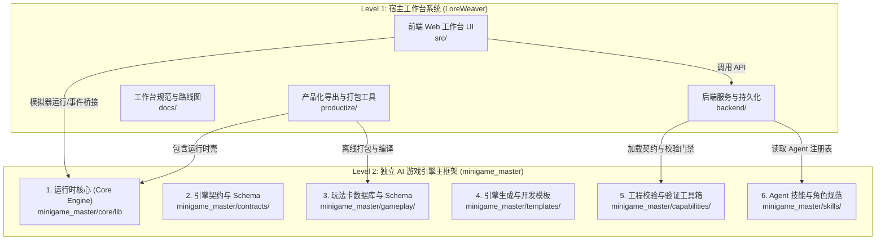

# LoreWeaver 全局架构与文档导航索引

本文档为进入 `LoreWeaver` 项目时的**必读总览指南**。

---

## 1. 项目两级分层架构 (Two-Level Architecture Hierarchy)

`LoreWeaver` 采用了清晰的**“宿主工作台系统 + AI 游戏引擎主框架”**两级分层架构：

---

## 2. 区域职责与修改指南 (Zone Responsibilities & Write Guidance)

| 区域 | 角色与定位 | 写入与修改指南 |
| --- | --- | --- |
| **`LoreWeaver/src`** | **工作台 Shell UI** 宿主 Web 前端、模拟器宿主、Manifest 编辑器、编排面板 | 修改此处用于扩展 LoreWeaver 工作台本身的 UI 控件、Agent 交互面板、标签页或数据通信桥接。此处 UI 并非生成的游戏本体。 |
| **`LoreWeaver/backend`** | **后端 API 服务** 数据持久化、工作区管理、编排 Endpoint、SQLite | 修改此处用于调整工作区文件读写、Job 编排、预设加载或导出 API。 |
| **`LoreWeaver/docs`** | **工作台规范与路线图** 全局架构规范、协作指南、路线图 Tasklist、策略 | 用于记录宿主工作台的架构边界、协作流程、Roadmap 及版权缓释策略。 |
| **`LoreWeaver/productize`** | **产品化打包流水线** 独立游戏导出、产物编译、发布包校验 | 用于管理单机独立包的构建编译、卡片校验、Patch 提取与最终验收打包。 |
| **`minigame_master`** | **AI 游戏引擎主框架** 高内聚、自包含的 AI 引擎与工具链 | **整个 AI 游戏引擎的实体**。包含 Core 运行时、Schema 契约、玩法卡数据库、Prompt/设计模板、校验工具箱及 Agent 技能。 |
| `LoreWeaver/data/workspaces/[id]` | **生成的具体游戏工作区** AI 编排生成的具体游戏项目目标产物 | 仅在针对特定生成的游戏工作区（如 `data/workspaces/20260611-060754-719406`）做直接调试或 Patch 时修改。该目录已被 gitignore 忽略。 |
| `minigame/xianni` `minigame/perfectworld_dahuang` | **历史参考案例库** 玩法抽样样本、证据源、图库参考 | 仅作为机制抽样的证据源（Provenance）。除非显式修改旧项目，否则默认**只读**。 |

---

## 3. 实用代码路由与改动规则

1. **测试生成的具体游戏工作区时**：优先检查并修复 `LoreWeaver/data/workspaces/[workspace-id]`。
2. **工作台模拟器渲染或游戏核心逻辑有误时**：检查 `LoreWeaver/src/game/GameRunner.ts` 以及 `minigame_master/core/lib` 下对应的 Gameplay Adapter。
3. **工作台面板、控件、标签页或 UI Chrome 变动时**：修改 `LoreWeaver/src/components` 及其 CSS 样式。
4. **修改引擎契约、玩法卡、生成模板或门禁校验时**：编辑 `minigame_master/` 下对应的 `contracts/`、`gameplay/`、`templates/`、`capabilities/` 或 `skills/` 目录。
5. **全局架构与工作流指南修改时**：修改 `LoreWeaver/docs/` 下对应的 `architecture/` 或 `guides/` 目录。

详细架构边界政策请参阅 [docs/architecture/LoreWeaver_Workspace_Boundaries.md](file:///Users/lm/pyProj/LoreWeaver/docs/architecture/LoreWeaver_Workspace_Boundaries.md)。

---

## 4. 目录与资产全局导航

### 宿主工作台说明文档库 (`docs/`)

- **[architecture/](file:///Users/lm/pyProj/LoreWeaver/docs/architecture/)**：系统架构与工作区边界规范
  - [current_system_architecture_and_core_features.md](file:///Users/lm/pyProj/LoreWeaver/docs/architecture/current_system_architecture_and_core_features.md)：当前系统架构与核心功能设计
  - [LoreWeaver_Workspace_Boundaries.md](file:///Users/lm/pyProj/LoreWeaver/docs/architecture/LoreWeaver_Workspace_Boundaries.md)：案例库、核心运行时与工作台的写入边界规范
  - [LoreWeaver.md](file:///Users/lm/pyProj/LoreWeaver/docs/architecture/LoreWeaver.md)：工作台设计白皮书
- **[guides/](file:///Users/lm/pyProj/LoreWeaver/docs/guides/)**：协作流程与指南
  - [precise_pipeline_1_1_to_3_3.md](file:///Users/lm/pyProj/LoreWeaver/docs/guides/precise_pipeline_1_1_to_3_3.md)：Step 1.1 至 Step 3.3 全流程跨角色彩排指南
  - [patch_revision_workflow.md](file:///Users/lm/pyProj/LoreWeaver/docs/guides/patch_revision_workflow.md)：Patch/Revision 工作流与级别政策 (L0-L4)
  - [production_department_agents.md](file:///Users/lm/pyProj/LoreWeaver/docs/guides/production_department_agents.md)：电影剧组式多 Agent 部门分工与责任界定
  - [agent_roles_artifact_ownership.md](file:///Users/lm/pyProj/LoreWeaver/docs/guides/agent_roles_artifact_ownership.md)：Agent 角色与产物归属对应表
- **[roadmap/](file:///Users/lm/pyProj/LoreWeaver/docs/roadmap/)**：产品路线图与任务 Backlog
  - [0_TASKLIST.md](file:///Users/lm/pyProj/LoreWeaver/docs/roadmap/0_TASKLIST.md)：当前全量执行 Backlog 与完成状态
  - [LoreWeaver_Workbench_Gameplay_Core_Roadmap.md](file:///Users/lm/pyProj/LoreWeaver/docs/roadmap/LoreWeaver_Workbench_Gameplay_Core_Roadmap.md)：玩法核心与工作台长期演进 Roadmap
- **[policy/](file:///Users/lm/pyProj/LoreWeaver/docs/policy/)**：策略文档
  - [copyright_and_fanwork_deferred_policy.md](file:///Users/lm/pyProj/LoreWeaver/docs/policy/copyright_and_fanwork_deferred_policy.md)：同人题材版权与离线发布清洗策略
- **[archive/](file:///Users/lm/pyProj/LoreWeaver/docs/archive/)**：历史 PRD、早期架构草稿与归档资料

---

### AI 游戏引擎主框架库 (`minigame_master/`)

- **[core/](file:///Users/lm/pyProj/LoreWeaver/minigame_master/core/)**：引擎运行时核心代码
  - `lib/`：通用模块（Audio, Systems, Interaction, Juice, Gameplay Adapters & Modifiers）
  - `demo/`：引擎独立测试与模拟环境
- **[contracts/](file:///Users/lm/pyProj/LoreWeaver/minigame_master/contracts/)**：引擎契约与机器可读 Schema
  - [core_contracts.md](file:///Users/lm/pyProj/LoreWeaver/minigame_master/contracts/core_contracts.md)：NodePayload, NodeResult, Adapter, Modifier, Lifecycle 稳定契约
  - [runtime_feature_pack_contract.md](file:///Users/lm/pyProj/LoreWeaver/minigame_master/contracts/runtime_feature_pack_contract.md)：可复用 Feature Pack 契约
  - `runtime_feature_pack.schema.json`：Runtime Feature Pack Schema 校验文件
  - `asset_pipeline_contract.md`：资产流水线契约
- **[gameplay/](file:///Users/lm/pyProj/LoreWeaver/minigame_master/gameplay/)**：玩法卡数据库与机制盘点
  - [gameplay_inventory.md](file:///Users/lm/pyProj/LoreWeaver/minigame_master/gameplay/gameplay_inventory.md)：玩法机制全量盘点与源码索引
  - [gameplay_card_schema.md](file:///Users/lm/pyProj/LoreWeaver/minigame_master/gameplay/gameplay_card_schema.md)：Gameplay Card 机器可读 Schema 规范
  - [cards/](file:///Users/lm/pyProj/LoreWeaver/minigame_master/gameplay/cards/)：包含了割草生存、即时反应、横版格斗、回合对战等全量 Gameplay Card JSON 数据库及其 `modifiers/` 修饰符与 `fixtures/`
- **[templates/](file:///Users/lm/pyProj/LoreWeaver/minigame_master/templates/)**：引擎构建与开发模板库
  - [document_templates/](file:///Users/lm/pyProj/LoreWeaver/minigame_master/templates/document_templates/)：PRD、架构、Canvas UI、GameFeel 等 11 个标准文档模板
  - [prompt_templates/](file:///Users/lm/pyProj/LoreWeaver/minigame_master/templates/prompt_templates/)：Step 1.1 至 Step 3.3 节点生成提示词模板
- **[capabilities/](file:///Users/lm/pyProj/LoreWeaver/minigame_master/capabilities/)**：引擎工程校验与自动化能力
  - [verification/](file:///Users/lm/pyProj/LoreWeaver/minigame_master/capabilities/verification/)：E2E 测试 (`run_e2e_test.py`)、烟雾测试 (`run_node_smoke.mjs`)、构建门禁 (`run_build_gate.mjs`)、代码卫生 (`check_scene_hygiene.mjs`) 与安全扫描脚本
  - [reports/](file:///Users/lm/pyProj/LoreWeaver/minigame_master/capabilities/reports/)：测试门禁运行结果输出目录
- **[skills/](file:///Users/lm/pyProj/LoreWeaver/minigame_master/skills/)**：引擎 AI Agent 技能与角色规范
  - [agents/](file:///Users/lm/pyProj/LoreWeaver/minigame_master/skills/agents/)：Playwright Tester 等 Agent 角色规范
  - [department_agents.registry.json](file:///Users/lm/pyProj/LoreWeaver/minigame_master/skills/department_agents.registry.json)：AI 部门代理注册表 JSON
