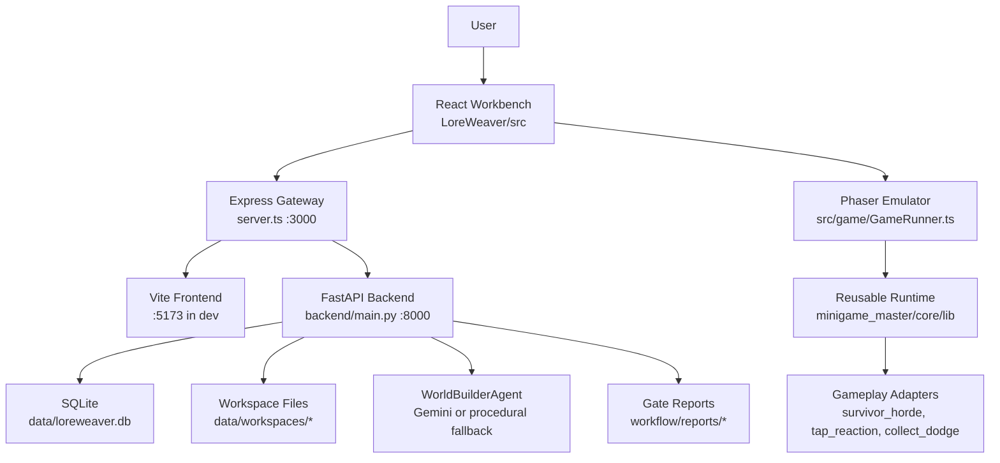

# Current System Architecture And Core Feature Design

> Current as of 2026-06-23. This document describes the implemented LoreWeaver workbench, not an aspirational historical PRD.

## 1. Product Positioning

LoreWeaver is an AI-assisted personal game workbench for turning a theme, world setting, or narrative direction into a playable H5 prototype. The current version is not a one-shot generator. It is a controlled workflow for creating, editing, previewing, auditing, exporting, and reusing small game prototypes.

The system keeps three responsibilities separate:

- `LoreWeaver`: workbench UI, backend orchestration, workspace persistence, manifest editing, gates, and design memory.
- `minigame_master/core`: reusable runtime contracts, gameplay adapters, modifiers, utilities, and demos.
- `minigame/*`: case-study and legacy reference projects used as evidence and provenance.

## 2. High-Level Architecture

## 3. Runtime Surfaces

| Surface | Main Paths | Responsibility |
| --- | --- | --- |
| Workbench UI | `src/App.tsx`, `src/components/*`, `src/store.tsx` | Panels, tabs, pipeline state, workspace selection, manifest editing, gameplay patch approval, visual audit trigger, export action |
| Emulator | `src/game/GameRunner.ts` | Embedded Phaser preview, idle cultivation shell, node entry, player state saving, runtime adapter launch, test hooks |
| Gateway | `server.ts` | Starts Vite and FastAPI in development, proxies `/api`, serves production `dist/` |
| Backend API | `backend/main.py` | Workspace CRUD/import/export, manifest file IO, presets, async jobs, chat refinement, audit endpoint |
| Persistence | `backend/models.py`, `backend/database.py`, `data/workspaces/*` | SQLite metadata plus per-workspace `meta.json` and `manifest.json` |
| Agent layer | `backend/agents.py`, `backend/theme_presets.py` | Gemini-backed GDD generation/refinement when configured; procedural fallback otherwise |
| Workflow assets | `workflow/prompts`, `workflow/templates`, `workflow/scripts`, `workflow/reports` | Generation prompts, output templates, build/runtime/content/audit gates, latest report snapshots |
| Runtime core | `../minigame_master/core/lib` | Node contracts, adapters, modifiers, audio/VFX/helpers, reusable gameplay logic |

## 4. Core Data Model

The central artifact is `manifest.json`, represented in TypeScript as `GameSpec`.

Core fields:

- `title`, `themeColor`, and `economy`: project identity, highlight color, currency, resources, and realms.
- `nodes[]`: the 12-stage narrative/progression structure with intro, taunts, mechanics, rewards, difficulty, duration, planning, and optional gameplay assignment.
- `progressionSystems[]`: long-term systems that feed node payloads and unlocks.
- `abilityCatalog`, `passiveSkillCatalog`, `characterDesignCatalog`, `enemyDesignCatalog`, `skillEffectCatalog`, `audioCueCatalog`: reusable runtime feature pack catalogs.
- `runtimeFeaturePack`: packaged ability/passive/character/enemy/VFX/SFX/asset pipeline contract.
- `workbench`: patches, revisions, and artifact freshness.

Gameplay runtime contracts live in `core_contracts.md`:

- `NodePayload`: data passed from shell/workbench into a playable node.
- `NodeResult`: normalized result returned by a node to mutate progression.
- `GameplayAdapter`: lifecycle boundary for playable behavior.
- `GameplayModifier`: optional behavior layered onto an adapter.
- `SceneLifecycle` and `TestHooks`: cleanup and browser-test observability rules.

## 5. Core Feature Design

### Workspace Management

The backend creates isolated workspaces with SQLite metadata and physical files under `data/workspaces/<workspace-id>/`. A workspace normally contains:

- `meta.json`: name, theme, creation and modified timestamps.
- `manifest.json`: active game spec consumed by the workbench and emulator.

The UI can auto-load the latest workspace, create a default workspace on first launch, import a local folder containing `manifest.json`, save manifest edits, and export the active workspace.

### Theme-To-Manifest Generation

The orchestration pipeline starts from a user theme and creates a pending GDD/manifest through `POST /api/jobs/start`.

Current staged flow:

| Stage | Purpose | Current behavior |
| --- | --- | --- |
| 1.1 IP DNA And Economy | Establish title, resources, realms, progression, abilities | Gemini generation if `GEMINI_API_KEY` exists; procedural fallback otherwise |
| 1.2 Node Outline | Produce 12 chronological nodes and planning hooks | Stores pending manifest on the job and waits for approval |
| 2.1-3.3 Compilation/QA | Shell, registry, node mechanics, juice, QA | Current backend simulates staged progress, then writes the approved manifest to workspace files |

The workbench polls job status, displays progress, supports role-based chat refinement, and commits the approved result into `manifest.json`.

### Workbench Editing And Patch Flow

Edits are designed to stay local and explicit. Gameplay changes are queued as `ManifestPatch` records before being applied.

Patch levels:

- `L0`: text and labels.
- `L1`: numeric knobs and reward tables.
- `L2`: gameplay card or modifier composition.
- `L3`: adapter implementation.
- `L4`: core/runtime contract.

Approving a patch mutates the manifest, creates a revision snapshot, and marks affected nodes/adapters/build/E2E gates as stale.

### Gameplay Cards And Modifiers

Gameplay Cards describe reusable node patterns and safe patch knobs. Machine-readable cards live in `../gameplay_cards/`; the human schema and review gate live in `../gameplay/gameplay_card_schema.md`.

The current frontend exposes a curated gameplay option list in `src/utils/gameplayManifest.ts`.

Current base/container cards include:

- `node_iframe_microgame`
- `survivor_horde`
- `turn_based_skill_battle`
- `rhythm_timing`
- `drag_collect_grid`
- `sequence_synthesis`

Implemented Phaser runtime adapters currently include:

- `survivor_horde`
- `tap_reaction`
- `collect_dodge`

Implemented `survivor_horde` modifiers include hazard, defend-core, escort, boss phase, poison fog, and laser-style pressure patterns through the reusable core modifier system.

### Emulator And Player Progression

`GameRunner.ts` hosts the in-workbench Phaser emulator. It provides:

- Boot scene and main shell.
- Idle currency production.
- Realm breakthrough and local player state persistence.
- 12-node progression display.
- Node launch into runtime adapters.
- WebAudio feedback through `AudioSynth`.
- Browser-test hooks through `TestHooks`.

The player state is stored in browser `localStorage`, while the project manifest is stored in workspace files through the backend.

### Visual Audit And Gates

The workbench can capture a real Phaser canvas screenshot and submit it to `/api/audit`. The audit path combines deterministic checks with optional Codex visual-agent review.

Current deterministic checks cover:

- Valid screenshot payload.
- Nonblank canvas pixels.
- Phaser/mobile fit scaling.
- text-wrap risk.
- touch safe-area sizing.

Codex visual audit is controlled by `LOREWEAVER_ENABLE_CODEX_AUDIT`; when disabled, reports show the visual agent as available but not invoked.

Scripted gates and report snapshots live under `workflow/scripts/` and `workflow/reports/`, including build, runtime E2E, scene hygiene, content safety, and runtime feature pack checks.

### Runtime Feature Pack And Asset Pipeline

The feature-pack contract promotes reusable project assets from one MVP into future workbench inputs. It covers:

- ability and passive catalogs.
- character and enemy design catalogs.
- skill VFX and audio cue catalogs.
- first-node skill loop verification.
- asset-pipeline metadata for ability VFX/voice, generated art, and audio manifests.

The human contracts live under `../contracts/`; the machine schema is `../contracts/runtime_feature_pack.schema.json`.

### Export

`GET /api/workspaces/{id}/export` returns a ZIP containing:

- `manifest.json`
- standalone `index.html` preview shell
- export `README.md`
- reusable `core/lib/`
- reusable `core/demo/`

The current standalone export is a portable manifest preview plus reusable core source. It is not yet a fully compiled custom game bundle with every node emitted as dedicated production code.

## 6. Current Boundaries And Deferred Items

- Local-model/Ollama routing is explicitly deferred; `OLLAMA_API_BASE` is logged and ignored.
- The current Step 2.1-3.3 backend pipeline records staged progress and writes the final manifest, but does not yet synthesize a full generated source tree per workspace.
- `docs/gameplay_cards/` is the machine-readable design library, while the frontend currently uses a curated hard-coded option list.
- Generated workspace artifacts are git-ignored and must be inspected directly when debugging a named workspace.
- Legacy projects under `minigame/*` are evidence by default; new Workbench UI and contracts belong in `LoreWeaver`, and reusable runtime logic belongs in `minigame_master/core`.
